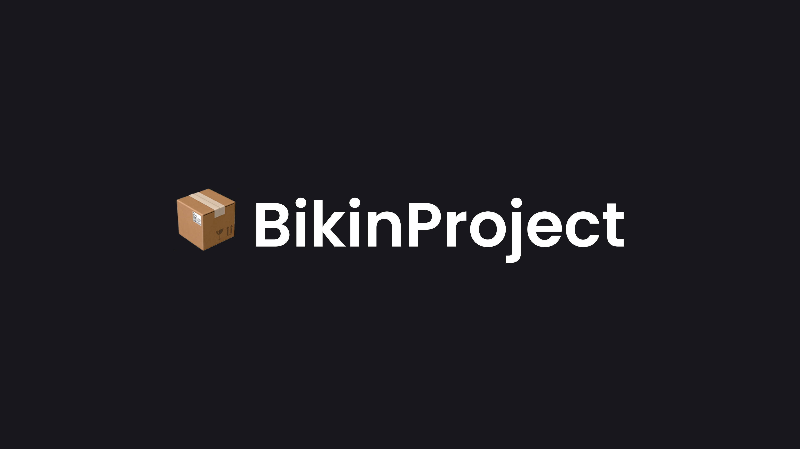

# create-bpa

  
  
  

`create-bpa` is a package alias for the [create-bikinproject-app](https://www.npmjs.com/package/create-bikinproject-app) package.

## License

This work is licensed under the [MIT LICENSE](./LICENSE).

## Author

Author name and contact info,

Naufal Akbar Nugroho
[Website](https://nuflakbrr.github.io)
[Github](https://github.com/nuflakbrr)
[Instagram](https://instagram.com/kbrnugroho)
